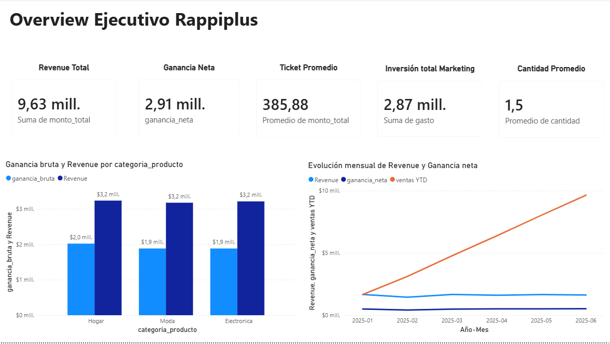
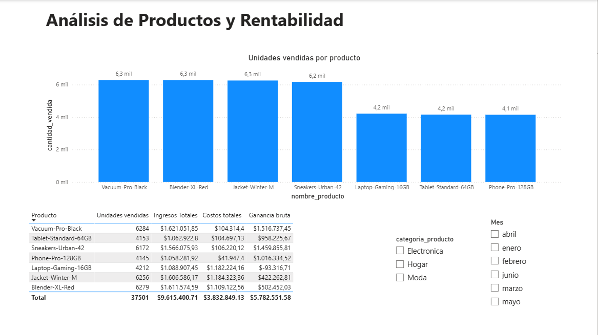
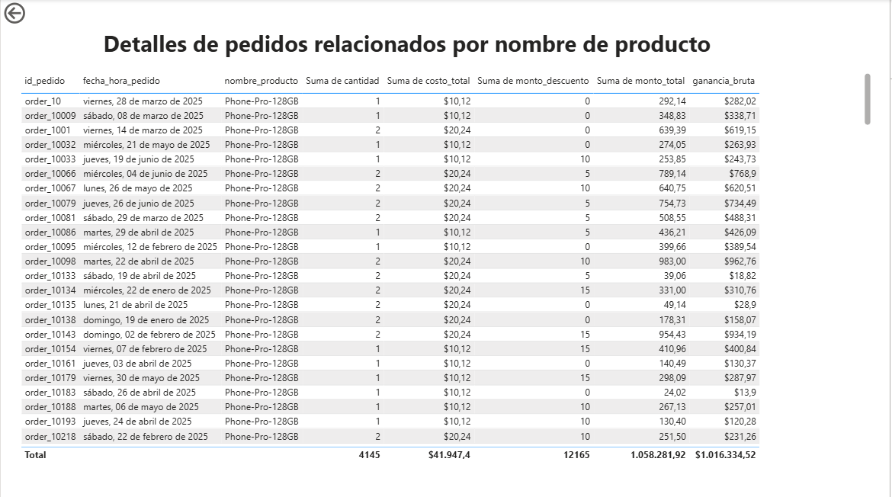

# RappiPlus | Análisis Comercial y Business Intelligence

## 📊 Descripción del proyecto

Proyecto integral de análisis de datos orientado a evaluar el desempeño comercial de **RappiPlus**, mediante el estudio de ingresos, costos, rentabilidad, comportamiento de usuarios y efectividad de las estrategias de conversión.

El objetivo es transformar datos operacionales en información útil para apoyar la toma de decisiones comerciales.

## 🎯 Objetivos

- Evaluar la rentabilidad del negocio mediante indicadores financieros.
- Identificar productos y categorías con mejor y peor desempeño comercial.
- Analizar el embudo de conversión de usuarios.
- Estudiar la retención de clientes mediante cohortes.
- Evaluar resultados de un experimento A/B utilizando pruebas estadísticas.
- Comunicar hallazgos mediante un dashboard interactivo en Power BI.

## 🛠️ Herramientas utilizadas

| Herramienta | Aplicación |
|---|---|
| Python | Limpieza, transformación y análisis de datos |
| Pandas y NumPy | Procesamiento y validación de datos |
| SciPy | Pruebas de hipótesis y análisis estadístico |
| SQL | Embudo de conversión y análisis de cohortes |
| Power BI | Visualización y análisis comercial |
| DAX | Construcción de indicadores de negocio |

## 🔎 Metodología

**1. Preparación y calidad de datos**

Validación de registros, tratamiento de valores inconsistentes, revisión de duplicados y corrección de cantidades y montos de venta.

**2. Análisis comercial y financiero**

Cálculo de ingresos, costos, ganancia bruta, ganancia neta y ticket promedio. Evaluación de la rentabilidad por producto y categoría.

**3. Análisis del comportamiento de usuarios**

Construcción de un embudo de conversión mediante SQL y evaluación de retención por cohortes.

**4. Experimentación estadística**

Análisis de un experimento A/B para evaluar diferencias en las tasas de conversión entre grupos.

**5. Visualización de resultados**

Desarrollo de un dashboard interactivo en Power BI con indicadores ejecutivos, análisis por producto y detalle de pedidos.

## 📊 Dashboard interactivo en Power BI

### Resumen Ejecutivo

### Análisis de Productos y Rentabilidad

### Detalle de Pedidos

## 📈 Principales hallazgos

- Se identificó un producto con rentabilidad bruta negativa, lo que permite detectar oportunidades de revisión de precios y costos.
- Se detectaron registros de productos sin costos asociados, destacando la importancia de la calidad de datos en los indicadores financieros.
- El análisis del embudo permitió evaluar la pérdida de usuarios entre las distintas etapas de conversión.
- El análisis de cohortes permitió estudiar la permanencia de los usuarios a lo largo del tiempo.
- La prueba A/B permitió evaluar estadísticamente si existían diferencias en las tasas de conversión.

## 📁 Estructura del repositorio

- `data/`: conjuntos de datos utilizados en el análisis.
- `dashboard/`: archivo interactivo de Power BI.
- `sql/`: consultas de conversión y retención.
- `notebooks/RappiPlus_Notebook_GitHub.ipynb`: análisis y procesamiento en Python.
- `README.md`: documentación general del proyecto.

## 💡 Conclusión

Este proyecto integra limpieza de datos, análisis comercial, consultas SQL, estadística y visualización de información para responder preguntas de negocio.

Demuestra competencias en la preparación de datos, identificación de hallazgos y comunicación de resultados mediante herramientas de Business Intelligence.

**Áreas de aplicación:** Análisis de Datos | Análisis Comercial | Business Intelligence | Visualización de Datos.
